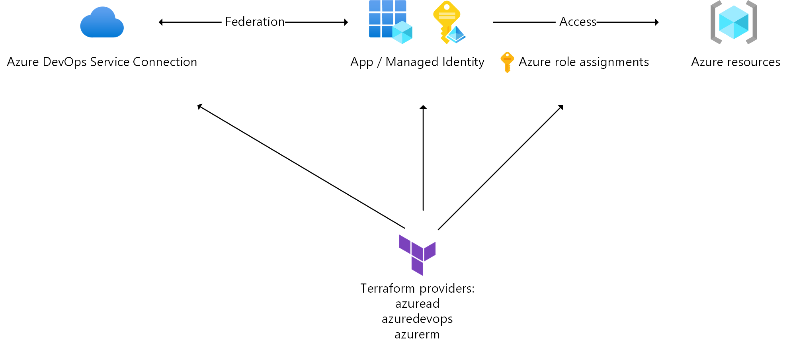
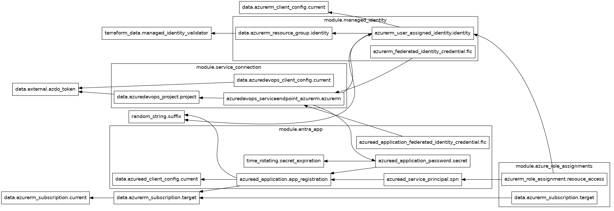

<!-- BEGIN_TF_DOCS -->
# Terraform-managed Azure Service Connection

[](https://dev.azure.com/geekzter/Pipeline%20Playground/_build/latest?definitionId=5&branchName=main)



Azure DevOps uses service connections to connect to services that are targets for cloud infrastructure provisioning and application deployment. The most commonly used service connection is the [Azure Resource Manager service connection](https://learn.microsoft.com/azure/devops/pipelines/library/connect-to-azure?view=azure-devops). This creates an object in Azure DevOps, an identity in Entra ID and a role assignment in Azure.

Many Enterprise customers have requirements around the management of Entra [workload identities](https://learn.microsoft.com/entra/workload-id/workload-identities-overview) (applications, service principals, managed identities) as well as the permissions they are assigned to.

Here are a few common requirements and constraints:

- Creation of app registrations is [disabled in the Entra ID tenant](https://learn.microsoft.com/entra/identity/role-based-access-control/delegate-app-roles#restrict-who-can-create-applications) and/or
the use of Managed Identities for Azure access is mandated
- Specific secret expiration and auto-rotation control
- ITSM metadata is required on Entra ID objects (service nanagement reference, naming convention, notes)
- Co-owners are required to exist for Entra ID apps
- Access is managed through Entra ID group membership
- Custom role assignments are needed for Azure [data plane](https://learn.microsoft.com/azure/azure-resource-manager/management/control-plane-and-data-plane#data-plane) access e.g. [Key Vault](https://learn.microsoft.com/azure/key-vault/general/rbac-guide?tabs=azure-cli#azure-built-in-roles-for-key-vault-data-plane-operations), [Kusto](https://learn.microsoft.com/azure/data-explorer/kusto/access-control/role-based-access-control), [Storage](https://learn.microsoft.com/azure/storage/blobs/assign-azure-role-data-access?tabs=portal)
- Access needs to be granted to multiple Azure subscriptions that are not part of the same management group
- An IT fulfillment process exists where identities are automatically provisioned based on a service request

## Why Terraform?

Terraform employs a provider model which enables all changes to be made by a single tool and configuration:

| Service      | Provider | API |
|--------------|----------|-----|
| Azure        | [azurerm](https://registry.terraform.io/providers/hashicorp/azurerm/latest/docs)     | [Azure Resource Manager REST API](https://learn.microsoft.com/rest/api/resources/) |
| Azure DevOps | [azuredevops](https://registry.terraform.io/providers/microsoft/azuredevops/latest/docs) | [Azure DevOps REST API](https://learn.microsoft.com/rest/api/azure/devops/serviceendpoint/endpoints) |
| Entra ID     | [azuread](https://registry.terraform.io/providers/hashicorp/azuread/latest/docs)     | [Microsoft Graph API](https://learn.microsoft.com/graph/use-the-api) |

[HCL](https://developer.hashicorp.com/terraform/language#about-the-terraform-language), the language used, is declarative and the tool is capable if inferring dependencies to create resources in order. This is the output from `terraform graph`:


More information:

- [Overview of Terraform on Azure - What is Terraform?](https://learn.microsoft.com/azure/developer/terraform/overview)
- [Cloud Adoption Framework - Infrastructure-as-Code CI/CD security guidance](https://learn.microsoft.com/azure/cloud-adoption-framework/secure/best-practices/secure-devops)

## Provisioning

Provisioning is a matter of specifying Terraform [variables](https://developer.hashicorp.com/terraform/language/values/variables) (see [inputs](#inputs) below) and running `terraform apply`. To set variables, you can create a .auto.tfvars file, see [sample](config.auto.tfvars.sample).
To understand how the Terraform configuration can be created in automation, review
[tf_create_azurerm_service_connection.ps1](../../../scripts/azure-devops/tf_create_azurerm_service_connection.ps1) and the
[CI pipeline](azure-pipelines.yml).  

### Examples

Below are common configurations. You can mix & match to create your own.

#### Default configuration

This creates an App registration with Federated Identity Credential and `Contributor` role on the Azure subscription used by the Terraform `azurerm` provider.

```hcl
azdo_organization_url          = "https://dev.azure.com/my-organization"
azdo_project_name              = "my-project"
```

Pre-requisites:

- The user can create app registrations i.e.:
  - Creation of app registrations is not [disabled in Entra ID](https://learn.microsoft.com/entra/identity/role-based-access-control/delegate-app-roles#restrict-who-can-create-applications);
  or
  - The user is member of a privileged Entra ID role e.g. [Application Developer](https://learn.microsoft.com/entra/identity/role-based-access-control/permissions-reference#application-developer)
- The user is an owner of the Azure subscription (so role assignment can be performed)

#### Managed Identity with FIC and custom RBAC

This creates a Managed Identity with Federated Identity Credential and custom Azure RBAC (role-based access control) role assignments:

```hcl
azdo_organization_url          = "https://dev.azure.com/my-organization"
azdo_project_name              = "my-project"
azure_role_assignments         = [
    {
        scope                  = "/subscriptions/00000000-0000-0000-0000-000000000000"
        role                   = "Contributor"
    },
    {
        scope                  = "/subscriptions/00000000-0000-0000-0000-000000000000/resourceGroups/rg"
        role                   = "Storage Blob Data Contributor"
    },
    {
        scope                  = "/subscriptions/00000000-0000-0000-0000-000000000000/resourceGroups/rg"
        role                   = "Key Vault Secrets User"
    }
]
create_federation              = true
create_managed_identity        = true
managed_identity_resource_group_id = "/subscriptions/11111111-1111-1111-1111-111111111111/resourceGroups/msi-rg"
```

Pre-requisites:

- A resource group to hold the Managed Identity has been pre-created
- The user is an owner of the Azure scopes to create role assignments on

#### Managed Identity assigned to Entra ID security group

This creates a Managed Identity with Federated Identity Credential and custom Azure RBAC (role-based access control) role assignments:

```hcl
azdo_organization_url          = "https://dev.azure.com/my-organization"
azdo_project_name              = "my-project"
azure_role_assignments         = [] # No direct assignments
create_federation              = true
create_managed_identity        = true
entra_security_group_names     = ["my-security-group"]
managed_identity_resource_group_id = "/subscriptions/11111111-1111-1111-1111-111111111111/resourceGroups/msi-rg"
```

Pre-requisites:

- A resource group to hold the Managed Identity has been pre-created
- The user is an owner of the Entra ID security group to add the Managed Identity to

#### App registration with FIC and ITSM metadata

This creates an Entra ID app registration with IT service reference and notes fields populated as well as specifying co-owners:

```hcl
azdo_organization_url          = "https://dev.azure.com/my-organization"
azdo_project_name              = "my-project"
create_federation              = true
create_managed_identity        = false
entra_app_notes                = "Service connection for business application ABC deployment to XYZ environment"
entra_app_owner_object_ids     = ["00000000-0000-0000-0000-000000000000","11111111-1111-1111-1111-111111111111"]
entra_service_management_reference = "11111111-1111-1111-1111-111111111111"
```

Pre-requisites:

- The user can create app registrations i.e.:
  - Creation of app registrations is not [disabled in Entra ID](https://learn.microsoft.com/entra/identity/role-based-access-control/delegate-app-roles#restrict-who-can-create-applications);
  or
  - The user is member of a privileged Entra ID role e.g. [Application Developer](https://learn.microsoft.com/entra/identity/role-based-access-control/permissions-reference#application-developer)
- The user is an owner of the Azure subscription (so role assignment can be performed)

#### App registration with short-lived secret and constrained RBAC

This creates an Entra ID app registration with secret that expires after 1 hour:

```hcl
azdo_organization_url          = "https://dev.azure.com/my-organization"
azdo_project_name              = "my-project"
azure_role_assignments         = [
    {
        scope                  = "/subscriptions/00000000-0000-0000-0000-000000000000/resourceGroups/rg"
        role                   = "Reader"
    }
]
create_federation              = false
create_managed_identity        = false
entra_secret_expiration_days   = 0 # secret lasts 1 hour
```

Pre-requisites:

- The user can create app registrations i.e.:
  - Creation of app registrations is not [disabled in Entra ID](https://learn.microsoft.com/entra/identity/role-based-access-control/delegate-app-roles#restrict-who-can-create-applications);
  or
  - The user is member of a privileged Entra ID role e.g. [Application Developer](https://learn.microsoft.com/entra/identity/role-based-access-control/permissions-reference#application-developer)
- The user is an owner of the Azure resource group (so role assignment can be performed)

## Terraform Configuration

The (required) variables and output are listed below. Sensitive outputs are masked by default.
Generated with [terraform-docs](https://terraform-docs.io/).

### Providers

| Name | Version |
|------|---------|
| <a name="provider_azuread"></a> [azuread](#provider_azuread) | 2.48.0 |
| <a name="provider_azurerm"></a> [azurerm](#provider_azurerm) | 3.101.0 |
| <a name="provider_external"></a> [external](#provider_external) | 2.3.3 |
| <a name="provider_random"></a> [random](#provider_random) | 3.6.1 |
| <a name="provider_terraform"></a> [terraform](#provider_terraform) | n/a |

### Modules

| Name | Source | Version |
|------|--------|---------|
| <a name="module_azure_role_assignments"></a> [azure_role_assignments](#module_azure_role_assignments) | ./modules/azure-access | n/a |
| <a name="module_entra_app"></a> [entra_app](#module_entra_app) | ./modules/app-registration | n/a |
| <a name="module_managed_identity"></a> [managed_identity](#module_managed_identity) | ./modules/managed-identity | n/a |
| <a name="module_service_connection"></a> [service_connection](#module_service_connection) | ./modules/service-connection | n/a |

### Inputs

| Name | Description | Type | Default | Required |
|------|-------------|------|---------|:--------:|
| <a name="input_azdo_organization_url"></a> [azdo_organization_url](#input_azdo_organization_url) | The Azure DevOps organization URL (e.g. https://dev.azure.com/contoso) | `string` | n/a | yes |
| <a name="input_azdo_project_name"></a> [azdo_project_name](#input_azdo_project_name) | The Azure DevOps project name to create the service connection in | `string` | n/a | yes |
| <a name="input_azdo_creates_identity"></a> [azdo_creates_identity](#input_azdo_creates_identity) | Let Azure DevOps create identity for service connection | `bool` | `false` | no |
| <a name="input_azure_role_assignments"></a> [azure_role_assignments](#input_azure_role_assignments) | Role assignments to create for the service connection's identity. If this is empty, the Contributor role will be assigned on the azurerm provider subscription. | `set(object({scope=string, role=string}))` | `null` | no |
| <a name="input_create_federation"></a> [create_federation](#input_create_federation) | Use workload identity federation instead of a App Registration secret | `bool` | `true` | no |
| <a name="input_create_managed_identity"></a> [create_managed_identity](#input_create_managed_identity) | Creates a Managed Identity instead of a App Registration | `bool` | `false` | no |
| <a name="input_entra_app_notes"></a> [entra_app_notes](#input_entra_app_notes) | Description to put in the Entra ID app registration notes field | `string` | `null` | no |
| <a name="input_entra_app_owner_object_ids"></a> [entra_app_owner_object_ids](#input_entra_app_owner_object_ids) | Object ids of the users that will be co-owners of the Entra ID app registration | `list(string)` | `null` | no |
| <a name="input_entra_secret_expiration_days"></a> [entra_secret_expiration_days](#input_entra_secret_expiration_days) | Secret expiration in days | `number` | `90` | no |
| <a name="input_entra_security_group_names"></a> [entra_security_group_names](#input_entra_security_group_names) | Names of the security groups to add the service connection identity to | `list(string)` | `[]` | no |
| <a name="input_entra_service_management_reference"></a> [entra_service_management_reference](#input_entra_service_management_reference) | IT Service Management Reference to add to the App Registration | `string` | `null` | no |
| <a name="input_managed_identity_resource_group_id"></a> [managed_identity_resource_group_id](#input_managed_identity_resource_group_id) | The resource group to create the Managed Identity in | `string` | `null` | no |
| <a name="input_resource_prefix"></a> [resource_prefix](#input_resource_prefix) | The prefix to put in front of resource names created | `string` | `"demo"` | no |
| <a name="input_resource_suffix"></a> [resource_suffix](#input_resource_suffix) | The suffix to append to resource names created | `string` | `""` | no |
| <a name="input_run_id"></a> [run_id](#input_run_id) | The ID that identifies the pipeline / workflow that invoked Terraform (used in CI/CD) | `number` | `null` | no |

### Outputs

| Name | Description |
|------|-------------|
| <a name="output_azdo_project_id"></a> [azdo_project_id](#output_azdo_project_id) | The Azure DevOps project id the service connection was created in |
| <a name="output_azdo_service_connection_id"></a> [azdo_service_connection_id](#output_azdo_service_connection_id) | The Azure DevOps service connection id |
| <a name="output_azdo_service_connection_name"></a> [azdo_service_connection_name](#output_azdo_service_connection_name) | The Azure DevOps service connection name |
| <a name="output_azdo_service_connection_url"></a> [azdo_service_connection_url](#output_azdo_service_connection_url) | The Azure DevOps service connection portal URL |
| <a name="output_azure_role_assignments"></a> [azure_role_assignments](#output_azure_role_assignments) | Role assignments created for the service connection's identity |
| <a name="output_azure_subscription_id"></a> [azure_subscription_id](#output_azure_subscription_id) | The Azure subscription id the service connection was granted access to |
| <a name="output_azure_subscription_name"></a> [azure_subscription_name](#output_azure_subscription_name) | The Azure subscription name the service connection was granted access to |
| <a name="output_entra_app_notes"></a> [entra_app_notes](#output_entra_app_notes) | Description provided in the app registration notes field |
| <a name="output_identity_application_id"></a> [identity_application_id](#output_identity_application_id) | The app/client id of the service connection's identity |
| <a name="output_identity_application_name"></a> [identity_application_name](#output_identity_application_name) | The name of the service connection's identity |
| <a name="output_identity_federation_subject"></a> [identity_federation_subject](#output_identity_federation_subject) | The federation subject |
| <a name="output_identity_issuer"></a> [identity_issuer](#output_identity_issuer) | The federation issuer |
| <a name="output_identity_object_id"></a> [identity_object_id](#output_identity_object_id) | The object id of the service connection's identity |
| <a name="output_identity_principal_id"></a> [identity_principal_id](#output_identity_principal_id) | The service principal id of the service connection's identity |
| <a name="output_identity_principal_name"></a> [identity_principal_name](#output_identity_principal_name) | The service principal name of the service connection's identity |
| <a name="output_identity_principal_url"></a> [identity_principal_url](#output_identity_principal_url) | The service principal portal url of the service connection's identity |
| <a name="output_identity_secret"></a> [identity_secret](#output_identity_secret) | The secret of the service connection's identity |
| <a name="output_identity_secret_end_date"></a> [identity_secret_end_date](#output_identity_secret_end_date) | The secret expiration date of the service connection's identity |
| <a name="output_identity_url"></a> [identity_url](#output_identity_url) | The portal url of the service connection's identity |
<!-- END_TF_DOCS -->